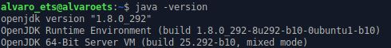
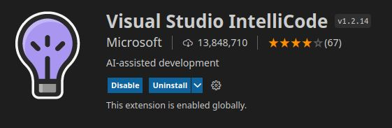
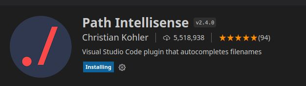
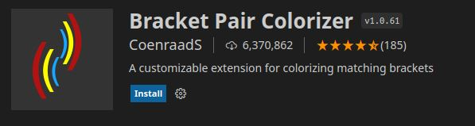
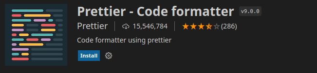
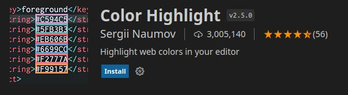
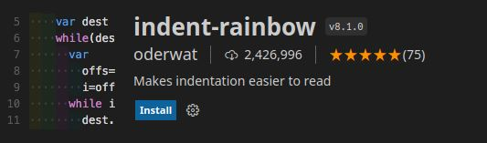

# Instalación del IDE Visual Studio Code

## Requisitos

Para la instalación de Visual Studio Code será necesario tener instalado java:

## Instalación

Para la instalación solamente tendremos que ejecutar el siguiente comando:

Comprobamos que aparecerá instalado en nuestro equipo.

## Extensiones

Una vez instalado el Visual Studio Code, vamos a instalar algunas extensiones que nos serán muy útiles.

- Java Extension Pack:

- Visual Studio IntelliCode:

- Path Intellisense:

- Bracket Pair Colorizer:

- GitLens:

- Prettier:

- Color Highlight:

- Indent Rainbow:

